# school_project
android mobile application and with internet support which is intended for schools ,to facilitate the teaching process for students from distance.

application made to log in from four users :
1. Students
2. Parents
3. Teachers
4. Admin

### helps users by: 
1. help teachers to send educational videos and the required material, and send assignments to students(
2. help students to receive the material and assignments and able to send the solutions
3. help parents to monitor their children to know if he/she studied the required material and do his/her HomeWorks
4. help admin of the school to add teacher and students and their parents and edit the information to application

## Design

#### 1. Home Screen 
The home screen, the user have to choose one from four type (student, teacher , parents , admin).

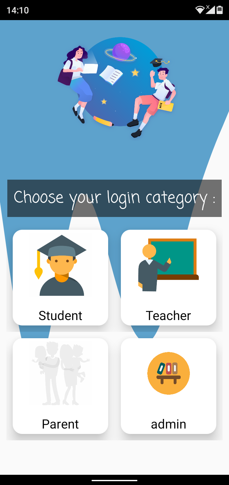

#### 2. login page
is the second page after home page which appears when the user chooses his category. In that page, if he is a new user, he can sign in by put his ssn in username and password (if he registered by admin), or if he is an existing user, he can login with the credentials.

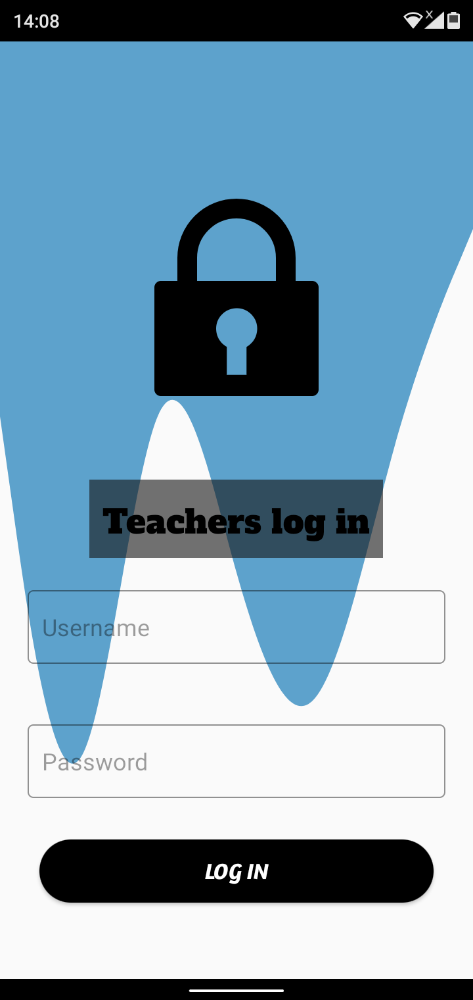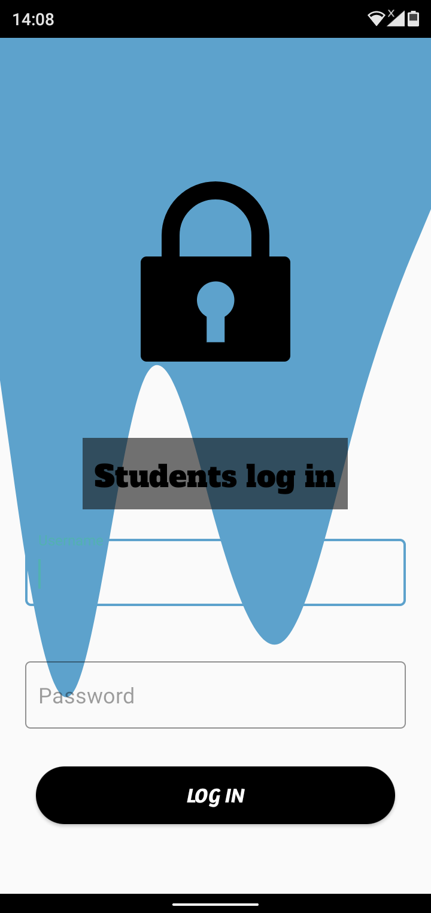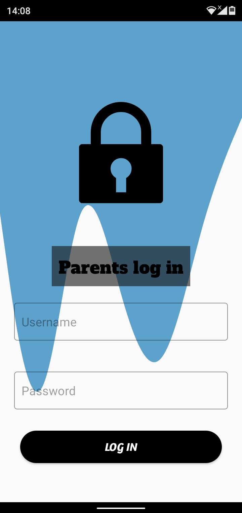
______

## ADMIN

#### 3. admin add users 
-student :It helps admin to add new users to database through user’s information, in below picture, it shows page that admin can add users, so for student and their parents, admin needs to add the following information :Student name, National Id, Phone number, sex, Age, Parent name, National Id and Phone for parent.

-teacher: admin needs to add 6 attributes as in figure 20 the following information : teacher name, National Id and phone, materials, sex ,Age.

other admin:When admin already stored in database and he have “add permission” in database, then he can add new admin by admin name, national id, phone, sex.

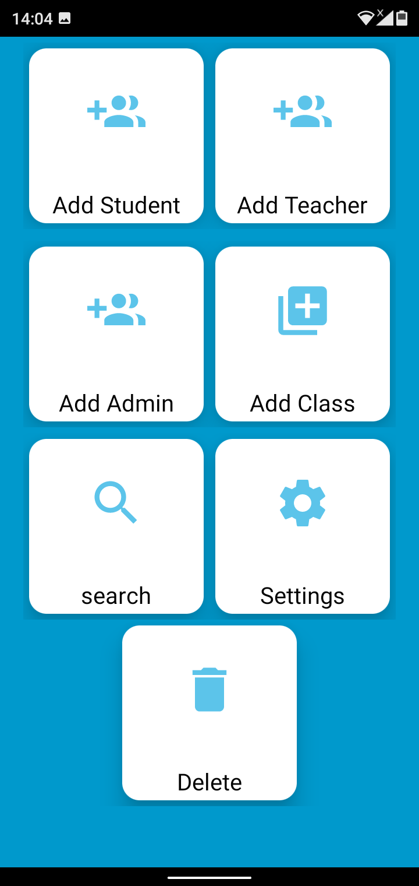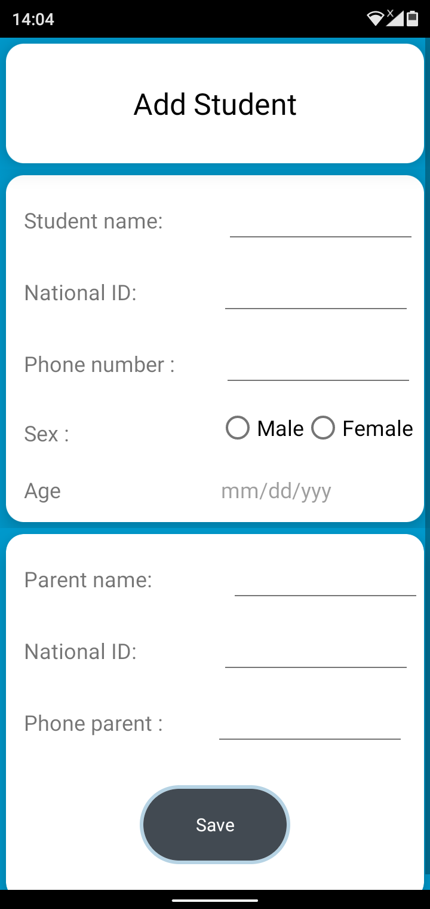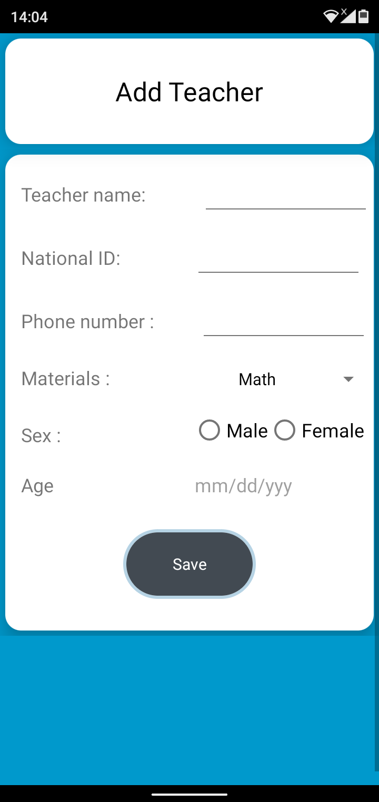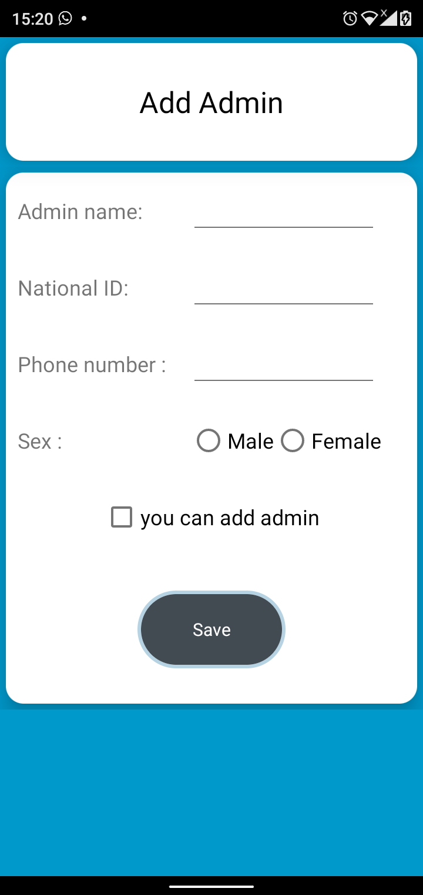

#### 4. admin search 
In admin page, admin can search for any user information in database, just by enter national id for user and choose type of user (student, admin, teacher, parent), so after choose the required, then admin need to click on search button, that button will open new activity to user information 

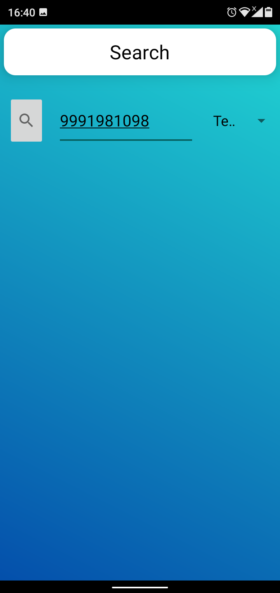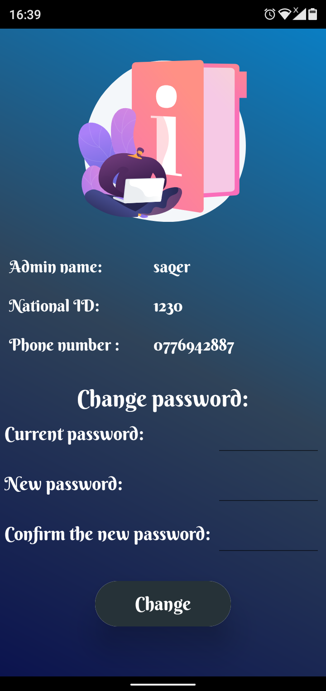

#### 5. admin change logo  
Admin can change school logo that will appear when application start , so admin can change logo through setting, then press “change the school logo” , then admin must choose logo from internal storage in phone.

Admin can change school name that will appear when application start as, so admin when open setting, admin need to put new name then press ok

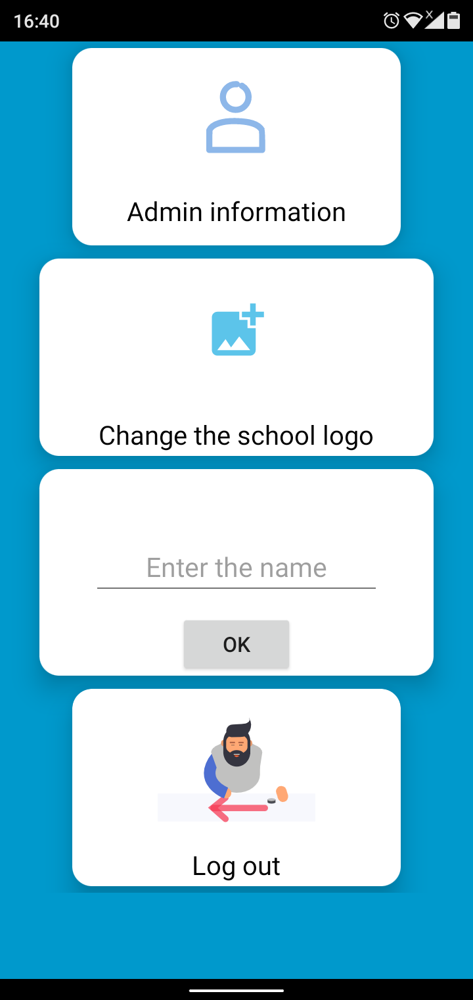

_____________
## TEACHER
### 6. Teacher Page with create class 
 the main page that appear when teacher login, in “my class” card view, when press on it, it will appear the last picture below, that show how much class teacher have already, and button to create new classes, so when press on create class, the second picture in the below will appear, teacher in this page can create class from grade 1 to 12, and each grade. can have more than 1, up to 10, and there 14 Subject that can teacher choose from subject option, and subject that can choose are the following: English, Arabic, Islamic studies, Christians studies, math, science, physics, chemistry, biology, information technology, geography, citizenship, physical education, art, so after click on create new class button, then will appear toast say “created successfully”.
 
 
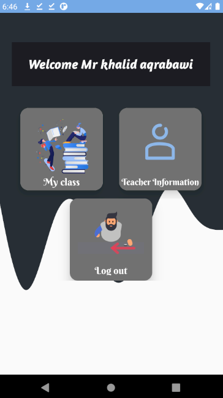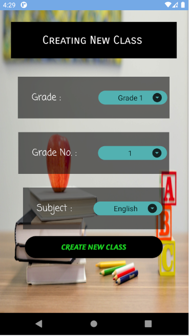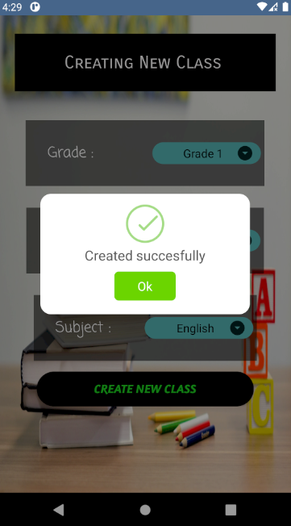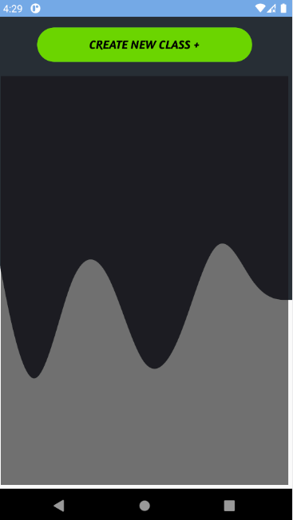

### 7. Edit Class
When teacher created class, it will appear in previous page, in this figure, and after created the class will appear as in this figure, so in this page teacher can go in class by press on green button “go to class” for add list of things, and also teacher can delete class be press on “delete”. 

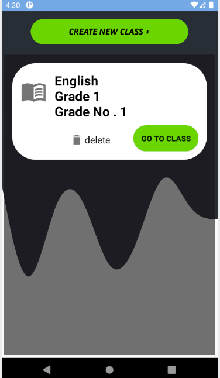

### 8. Teacher Upload Video
Teacher can upload video from internal phone storage then when choose video, teacher can pick name for it and it will save in database in storage

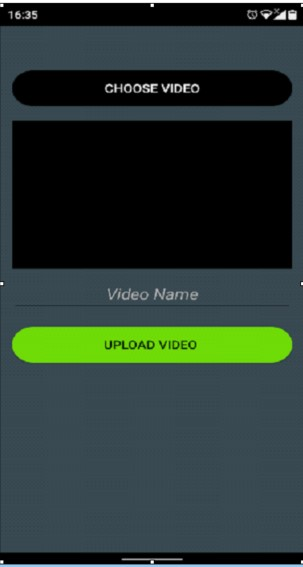

### 9. Teacher Upload File 
Teacher can also upload files like words and pictures that will appear for students, so when teacher choose file, it will store in storage in database

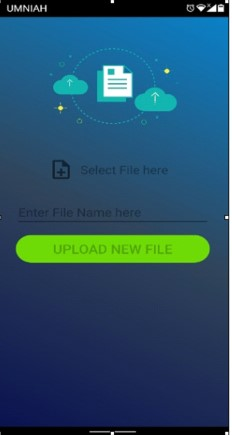

### 10. Teacher Add and Remove and Show  Students
Teacher can add new Student by enter their national id then press add.Teacher also can remove students who added before in class, by enter national id for required student and then press remove.

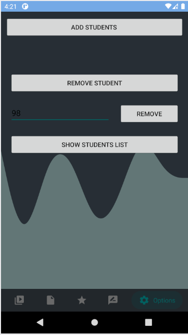

### 11. Teacher Mark Students
Teacher can rate their students in mark section,  so teacher have first to choose student by click in his name in the list, then will appear the second picture below , that appear list of marks that marked before and two button ,first one to add new mark, and the second to back to previous page,  when teacher press on add marks button, to  complete  mark process for student, need to enter mark name ,mark value , the highest value that can student get it in this subject, so after enter all the required info ,it will appear in previous page in teacher ,and in mark section in students and parents .

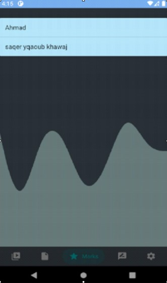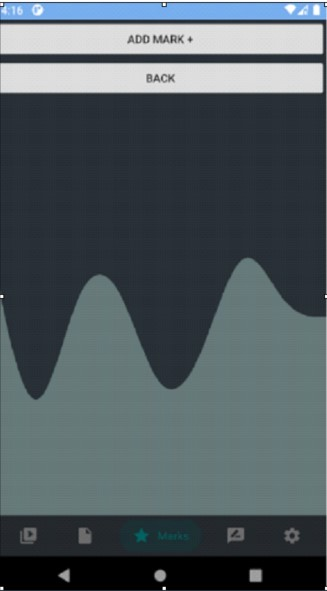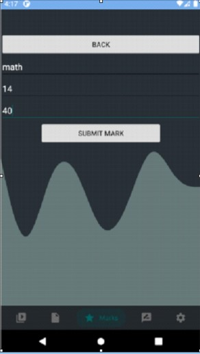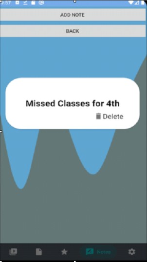
 
__________
## STUDENT

### 12. Student show class
When student login by username and password, main page has 3 card view, the first one my class, and student information, logout, in my class, it will show his current subjects in the class.

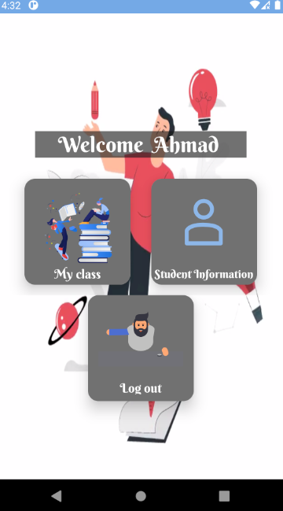

### 13. Student show video:
when teacher upload videos, the videos will appear in all students that include in class , student when open video section in same class, it will appear video and student able to watch the video in browser and optionally to download it, in the video section after go in the required class , the videos will appear below each other’s, with video name and button beside it to go to the video to each one of them.

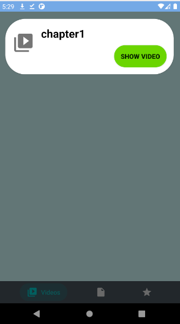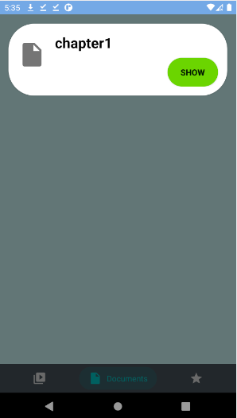

### 14. Student class grades 
Teacher can put student’s marks in their page, so students and their parents will appear marks in “mark section”

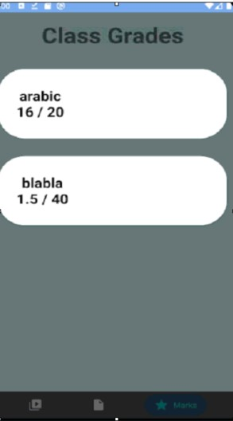

____________
## Parents

### 15. Student show class
When parent press on my children button, then their children will appear in next page, they can choose anyone from list to know their marks , mark section will appear after choose mark icon from below after choosing one of children 

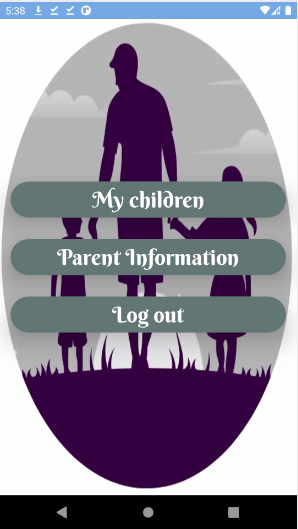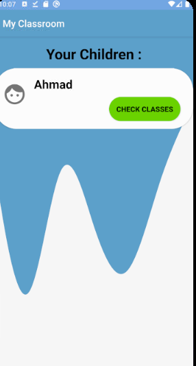

### 16. show notes 
When teacher write note about any student in note section, then the note will appear in their parent’s note section, after choosing one of children in list 

____________

### 17. Logout 
Any user has logged in their account, they can by press in log out button to exit their account, so when log Out, they must enter username and password to log in again, it shows log out button that exist in every user page.

